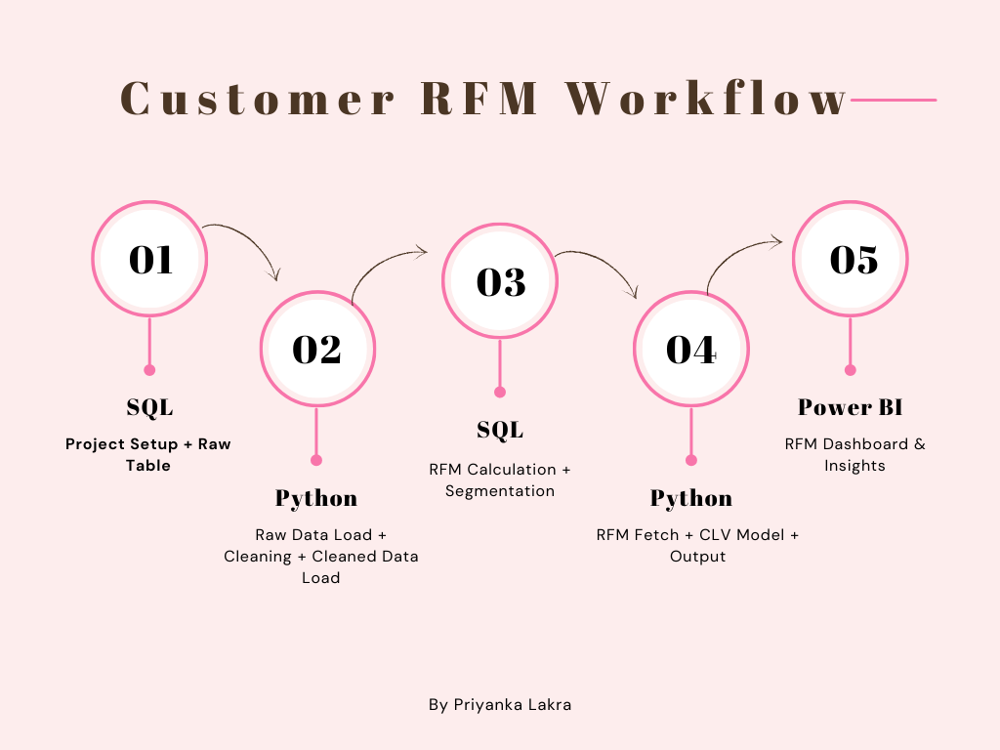

# Customer RFM + CLV Analytics

   

---

## Project Overview

This project focuses on Customer RFM + CLV Analytics and presents the analysis in a clear, practical way.

This project focuses on data-driven analysis and decision support. It is presented in a simple way so the main analysis and output are easy to understand.

## How the Project Works

  

## What This Project Does

- Focuses on data-driven analysis and decision support.
- Uses the technologies shown below to complete the analysis or build the project output.
- Includes visual output that makes the results easier to review.

## Technologies Used

| Technology | How It Is Used |
|------------|----------------|
| Jupyter Notebook | Used in the project |
| SQL | Used in the project |
| Power BI | Used in the project |
| CSV | Used in the project |

## Dashboard / Output

## Project Application

This project shows how data-driven analysis and decision support can be approached with data and analytics. It can be useful for understanding the problem, comparing important information, and supporting better decisions.

---

[<- Return to Sales & Marketing Analytics Portfolio](https://github.com/gawandeshil03-ops/sales-marketing-analytics-portfolio)